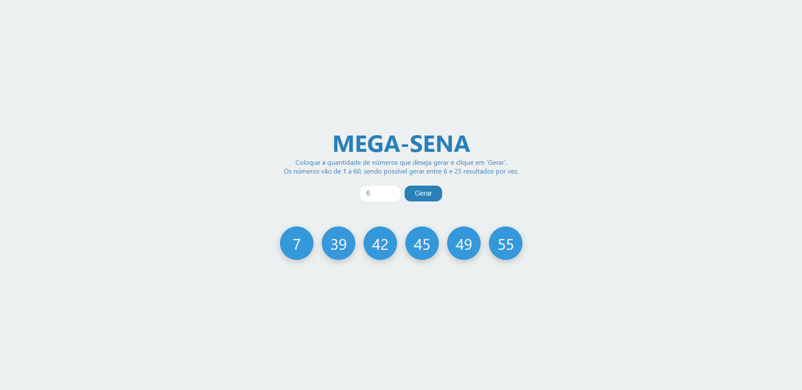

# Mega-Sena
Um simples sistema de gerar números aleatórios da Mega-Sena. Projeto desenvolvido apenas para treinamento pessoal no curso "Next.js & React" da Cod3r.

Deploy do projeto: https://gerador-mega-sena.vercel.app/

Para utilizar o programa use: 

```
git clone https://github.com/viniciuslima21/megaSena.git
```

## Tecnologias utilizadas
* Html
* CSS
* JavaScript
* ReactJs

## Imagem do projeto

